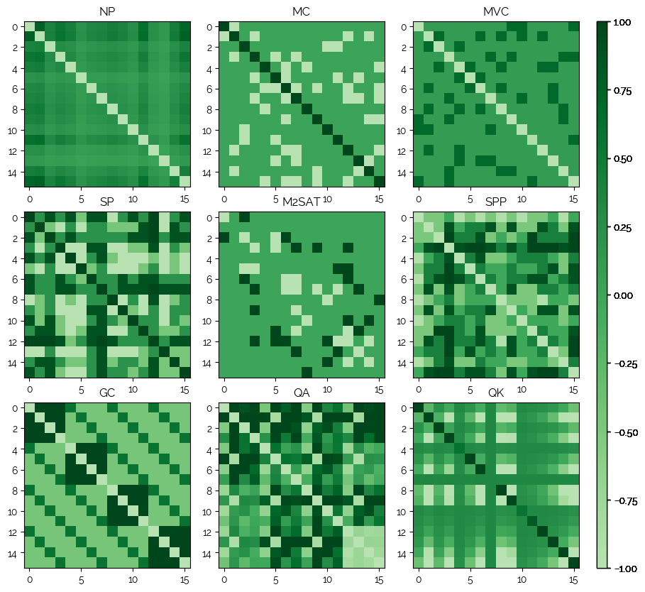
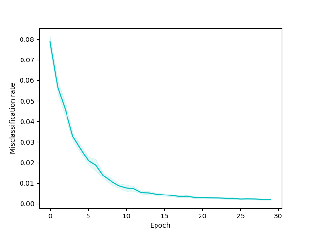

## QUBO - NN


<p align="center">
  9 problems and their respective QUBO matrices.
</p>

QUBO matrices are used to describe an optimization problem as a matrix such that a Quantum Annealer (such as a D-Wave QA) can solve it.

Now, these matrices are quite an interesting construct.. Thus, a few questions arise:

* Is it possible to classify the problem class based on the QUBO matrix?
* What is the exact trade-off when auto-encoding QUBO matrices, i.e. who far can one go before the solution quality drops significantly?

Let's find out.

## Project Structure

|File|Purpose|
|----|-------|
|nn/|Contains neural network models.|
|problems/|Contains generators and evaluators for specific problems such as 3SAT or TSP.|
|qubo/|Will contain the generic QUBO library.|
|datasets/|Contains generated datasets.|
|models/|Contains trained models.|
|config.py|Configuration (json) handling.|
|main.py|Main entry point.|
|pipeline.py|End to end training and testing of NNs on QUBO matrices.|
|simulations.json|All experiments and configurations.|

Problems implemented so far:

* Number Partitioning
* Maximum Cut
* Minimum Vertex Cover
* Set Packing
* Max 2-SAT
* Set Partitioning
* Graph Coloring
* Quadratic Assignment
* Quadratic Knapsack
* Max 3-SAT
* Travelling Salesman (TSP)

## Setup

```
pip3 install -r requirements.txt
pip3 install -e .
```

## Using

### Classification

```
usage: main.py [-h] [-t TYPE] [--eval] [--gendata] [--train] [-c CFG_ID] [-m [MODEL]]

optional arguments:
  -h, --help            show this help message and exit
  -t TYPE, --type TYPE  Type (classify)
  --eval
  --gendata
  --train
  -c CFG_ID, --cfg_id CFG_ID
                        cfg_id
  -m [MODEL], --model [MODEL]
```

Examples:
```
python3 -m qubo_nn.main -t classify -c 2 --train
python3 -m qubo_nn.main -t classify -c 2 --eval -m models/21-02-16_20\:28\:42-9893713-instances-MacBook-Pro.local-2 
```

TODO

### Generating QUBOs for arbitrary problems

This is an example on how to create a MaxCut instance and generate a QUBO matrix for it:

```
>>> graph = networkx.Graph([(1, 2), (1, 3), (2, 4), (3, 4), (4, 5), (3, 5)])
>>> problem = MaxCut(graph)
>>> matrix = problem.gen_qubo_matrix()
[
    [2, -1, -1, 0, 0],
    [-1, 2, 0, -1, 0],
    [-1, 0, 3, -1, -1],
    [0, -1, -1, 3, -1],
    [0, 0, -1, -1, 2]
]
```

The list of problems can be found in `qubo_nn/problems/__init__.py`. Also:

```
>>> from qubo_nn.problems import PROBLEM_REGISTRY
>>> PROBLEM_REGISTRY
{
    'NP': <class 'qubo_nn.problems.number_partitioning.NumberPartitioning'>,
    'MC': <class 'qubo_nn.problems.max_cut.MaxCut'>,
    'MVC': <class 'qubo_nn.problems.minimum_vertex_cover.MinimumVertexCover'>,
    'SP': <class 'qubo_nn.problems.set_packing.SetPacking'>,
    'M2SAT': <class 'qubo_nn.problems.max2sat.Max2SAT'>,
    'SPP': <class 'qubo_nn.problems.set_partitioning.SetPartitioning'>,
    'GC': <class 'qubo_nn.problems.graph_coloring.GraphColoring'>,
    'QA': <class 'qubo_nn.problems.quadratic_assignment.QuadraticAssignment'>,
    'QK': <class 'qubo_nn.problems.quadratic_knapsack.QuadraticKnapsack'>,
    'M3SAT': <class 'qubo_nn.problems.max3sat.Max3SAT'>,
    'TSP': <class 'qubo_nn.problems.tsp.TSP'>
    ...
}
```

## Results

### Classification

Using parameter configuration `18_lr2_leaky` (see `simulations.json`), the average total misclassification rate over 38 models goes to zero.



### Reversability

This shows whether we can deduce the parameters that led to a QUBO matrix, given we predicted the problem beforehand.
A lot of the graph based problems are easily reversable since the graph structure is kept intact in the QUBO matrix. Thus we can recreate the graph and other input parameters given a GraphColoring QUBO matrix.

This is still WIP - needs testing. These are hypotheses.

Reversing some problems like Quadratic Knapsack might be possible - an algorithm is an idea, but one could also make their life easy and try fitting a NN model to it.

|Problem|Reversability|Comment|
|-------|-------------|-------|
|Graph Coloring|**+**|Likely trivial.|
|Maximum 2-SAT|**-**|Multiple inputs lead to the same output (see `qubo_nn.contrib.non_reversible`).|
|Maximum 3-SAT|**-**|Multiple inputs lead to the same output (see `qubo_nn.contrib.non_reversible`).|
|Maximum Cut|**+**|Likely trivial.|
|Minimum Vertex Cover|**+**|Likely trivial.|
|Number Partitioning|**+**|Easy, create equation system from the upper triangular part of the matrix (triu).|
|Quadratic Assignment|**-**|Needs factoring. Sometimes possible for integers, but in case of floats impossible.|
|Quadratic Knapsack|**?**|Budgets can be deduced easily (Find argmin in first row. This column contains all the budgets.), rest possibly but not easily.|
|Set Packing|**?**|No idea. TODO|
|Set Partitioning|**-**|P and costs cannot be deduced from one number.|
|Travelling Salesman|**+**|Find a quadrant with non-zero entries (w/ an identical diagonal), transpose, the entries are the distance matrix. Norm result to between 0 and 1.|

## Contributing

Pull requests are very welcome. Before submitting one, run all tests with `./test.sh` and make sure nothing is broken.

## References

```
Glover, Fred, Gary Kochenberger, and Yu Du. "A tutorial on formulating and using qubo models." arXiv preprint arXiv:1811.11538 (2018).
Michael J. Dinneen, "Maximum 3-SAT as QUBO" https://canvas.auckland.ac.nz/courses/14782/files/574983/download?verifier=1xqRikUjTEBwm8PnObD8YVmKdeEhZ9Ui8axW8HwP&wrap=1
```

## Related Work

[Hadamard Gate Transformation for 3 or more QuBits](https://blog.xa0.de/post/Hadamard-Gate-Transformation-for-3-or-more-QuBits/)

[QUBOs for TSP and Maximum-3SAT](https://blog.xa0.de/post/QUBOs-for-TSP-and-Maximum---3SAT/)
