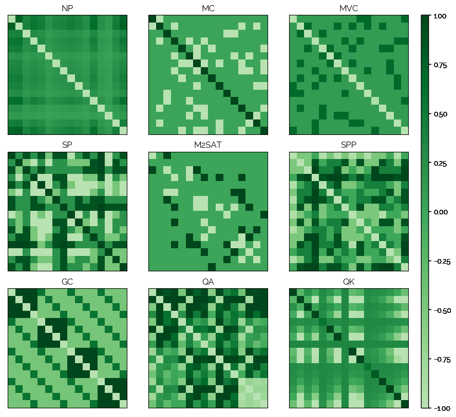

## QUBO - NN


<p align="center">
  9 problems and their respective QUBO matrices.
</p>

QUBO matrices are used to describe an optimization problem as a matrix such that a Quantum Annealer (such as a D-Wave QA) can solve it.

Now, these matrices are quite an interesting construct.. Thus, a few questions arise:

* Is it possible to classify the problem class based on the QUBO matrix?
* What is the exact trade-off when auto-encoding QUBO matrices, i.e. who far can one go before the solution quality drops significantly?

Let's find out.

## Project Structure

|File|Purpose|
|----|-------|
|nn/|Contains neural network models.|
|problems/|Contains generators and evaluators for specific problems such as 3SAT or TSP.|
|qubo/|Will contain the generic QUBO library.|
|datasets/|Contains generated datasets.|
|models/|Contains trained models.|
|config.py|Configuration (json) handling.|
|main.py|Main entry point.|
|pipeline.py|End to end training and testing of NNs on QUBO matrices.|
|simulations.json|All experiments and configurations.|

Problems implemented so far:

* Number Partitioning
* Maximum Cut
* Minimum Vertex Cover
* Set Packing
* Max 2-SAT
* Set Partitioning
* Graph Coloring
* Quadratic Assignment
* Quadratic Knapsack

## Setup

```
pip3 install -r requirements.txt
pip3 install -e .
```

## Using

### Classification

```
usage: main.py [-h] [-t TYPE] [--eval] [--gendata] [--train] [-c CFG_ID] [-m [MODEL]]

optional arguments:
  -h, --help            show this help message and exit
  -t TYPE, --type TYPE  Type (classify)
  --eval
  --gendata
  --train
  -c CFG_ID, --cfg_id CFG_ID
                        cfg_id
  -m [MODEL], --model [MODEL]
```

Examples:
```
python3 -m qubo_nn.main -t classify -c 2 --train
python3 -m qubo_nn.main -t classify -c 2 --eval -m models/21-02-16_20\:28\:42-9893713-instances-MacBook-Pro.local-2 
```

TODO

### Generating QUBOs for arbitrary problems

This is an example on how to create a MaxCut instance and generate a QUBO matrix for it:

```
>>> graph = networkx.Graph([(1, 2), (1, 3), (2, 4), (3, 4), (4, 5), (3, 5)])
>>> problem = MaxCut(graph)
>>> matrix = problem.gen_qubo_matrix()
[
    [2, -1, -1, 0, 0],
    [-1, 2, 0, -1, 0],
    [-1, 0, 3, -1, -1],
    [0, -1, -1, 3, -1],
    [0, 0, -1, -1, 2]
]
```

The list of problems can be found in `qubo_nn/problems/__init__.py`. Also:

```
>>> from qubo_nn.problems import PROBLEM_REGISTRY
>>> PROBLEM_REGISTRY
{
    'NP': <class 'qubo_nn.problems.number_partitioning.NumberPartitioning'>,
    'MC': <class 'qubo_nn.problems.max_cut.MaxCut'>,
    'MVC': <class 'qubo_nn.problems.minimum_vertex_cover.MinimumVertexCover'>,
    'SP': <class 'qubo_nn.problems.set_packing.SetPacking'>,
    ...
}
```

## Contributing

Pull requests are very welcome. Before submitting one, run all tests with `./test.sh` and make sure nothing is broken.

## References

```
Glover, Fred, Gary Kochenberger, and Yu Du. "A tutorial on formulating and using qubo models." arXiv preprint arXiv:1811.11538 (2018).
```

## Related Work

[Hadamard Gate Transformation for 3 or more QuBits](https://blog.xa0.de/post/Hadamard-Gate-Transformation-for-3-or-more-QuBits/)
